# C4 Architecture Diagrams

C4 levels 1–4 for the Claims API, plus sequence diagrams. Diagrams are Mermaid and render on GitHub, GitLab, and in VS Code (Markdown Preview Mermaid Support extension).

Each level shows the **as-is** system (what is in the repository) and, where useful, the **target** state (what a production healthcare platform would need). Target elements are labelled *(target)* and are **proposals, not existing code**.

> Context assumption (from the exercise brief): Stellarus is building a new healthcare platform backed by a California Blue Cross Blue Shield organization. Actors and external systems below (members, providers, payer core systems) are illustrative assumptions, not facts about Stellarus's actual landscape.

---

## Level 1: System Context

### 1a. As-is

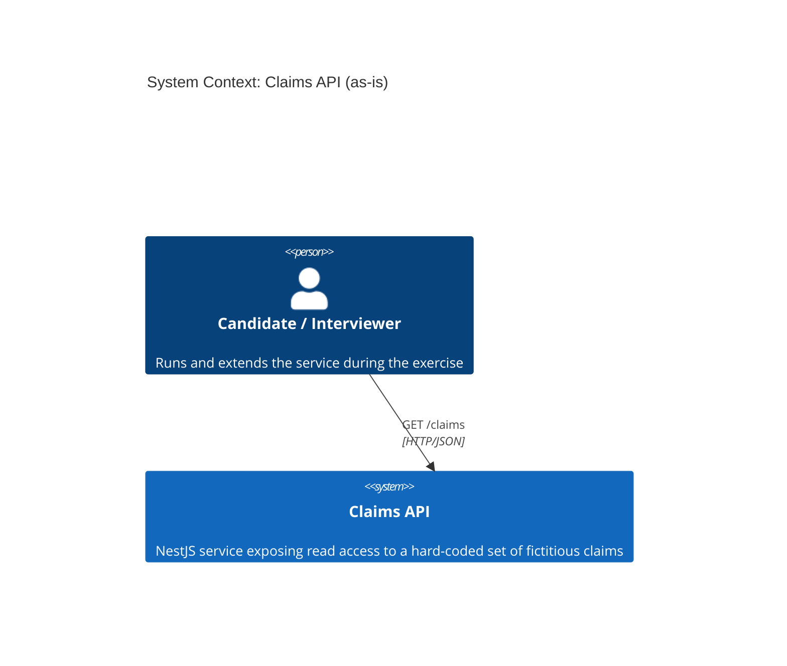

### 1b. Target platform context (illustrative)

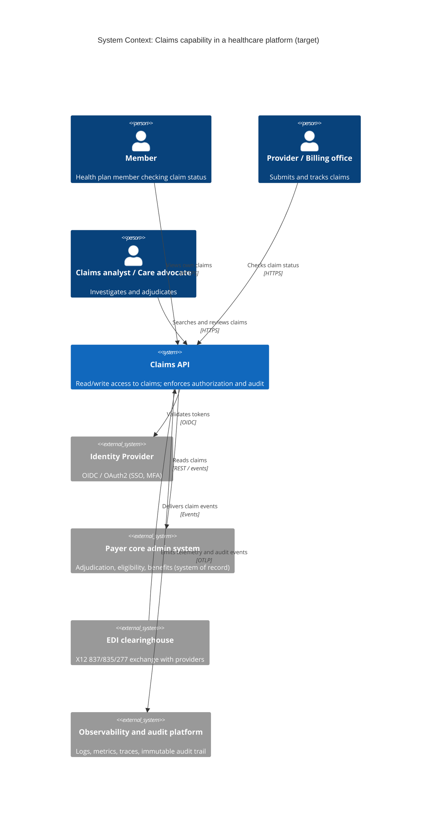

---

## Level 2: Containers

### 2a. As-is

A single deployable process; no database, cache, queue, or gateway.

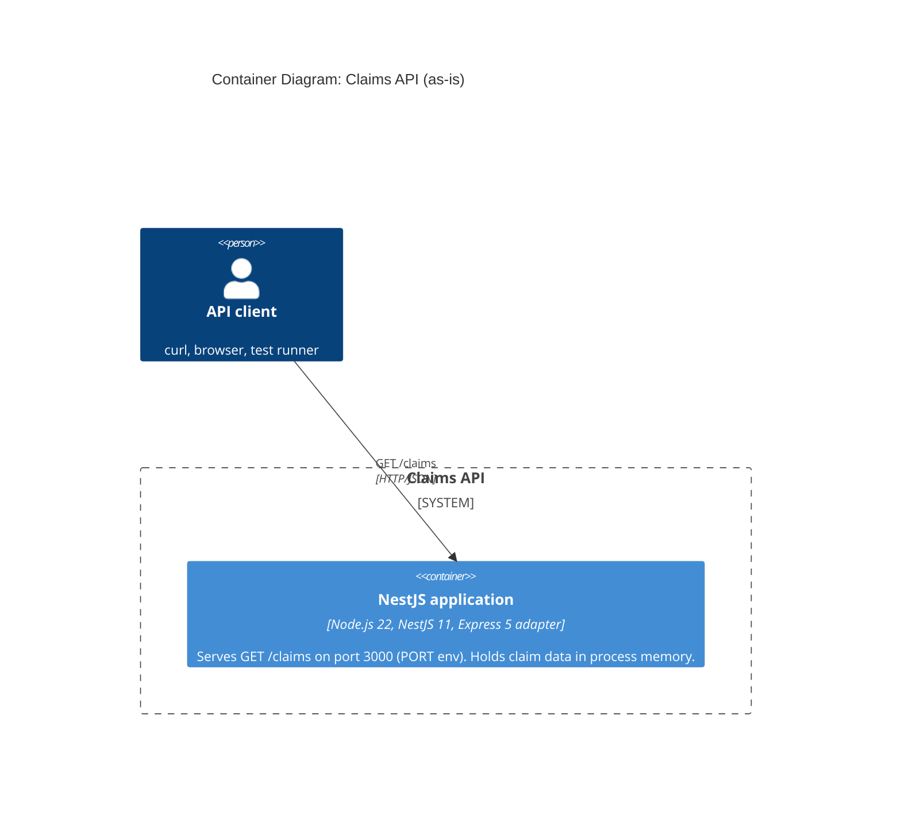

Packaging: the `Dockerfile` builds an image (`node:22-alpine`, multi-stage, non-root `node` user, `EXPOSE 3000`, `CMD node dist/main.js`).

### 2b. Target (illustrative)

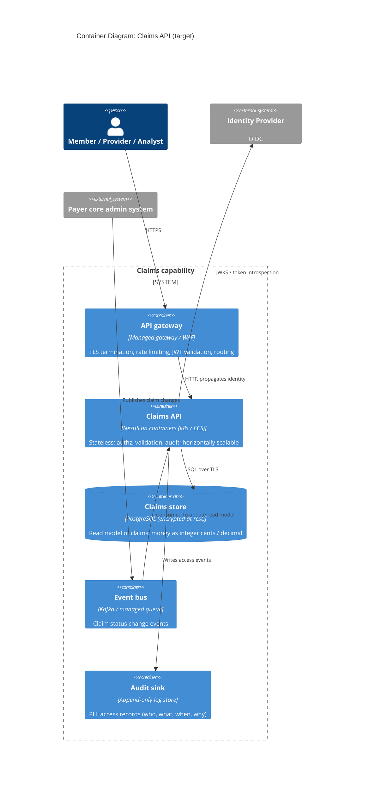

---

## Level 3: Components

### 3a. As-is: inside the NestJS application

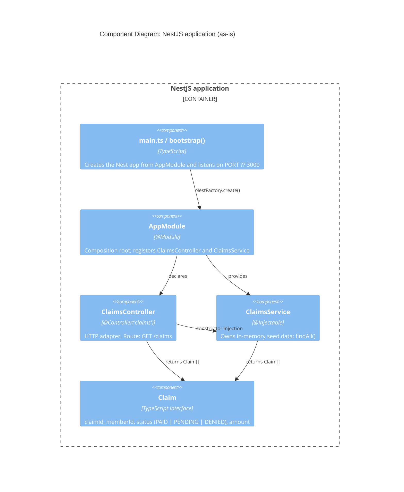

Design observations (details in the review):

- Controller and service are cleanly separated, and DI is used correctly.
- There is no repository/port abstraction: the service *is* the data store. Replacing the array with a database means rewriting the service rather than swapping an adapter.
- `Claim` is a plain interface used as both the domain and the wire type (no DTO).
- Cross-cutting concerns (auth, validation, logging, error mapping, OpenAPI) are absent.

### 3b. Target: hexagonal / layered `claims` module (illustrative)

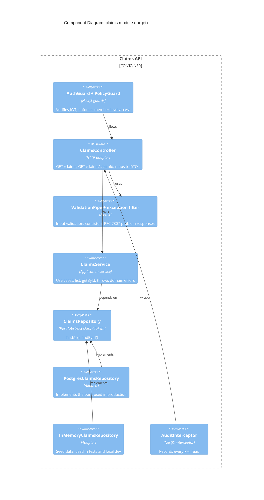

---

## Level 4: Code

### 4a. As-is class diagram

Matches `src/` exactly.

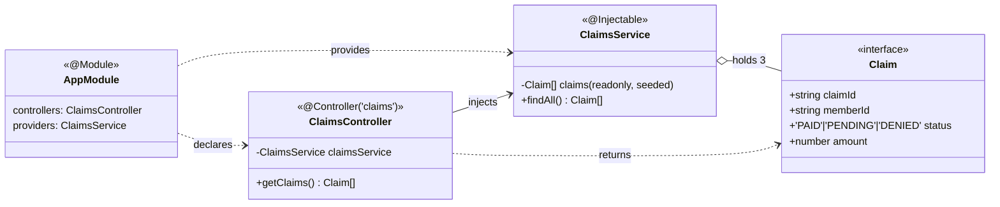

### 4b. Class diagram after implementing the exercise

Additions are marked `«new»`.

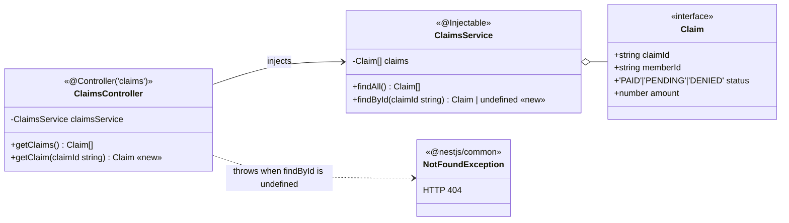

### 4c. Target class diagram (illustrative)

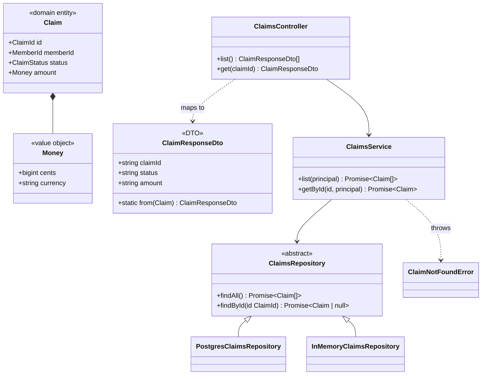

---

## Sequence Diagrams

### S1. Application startup (as-is)

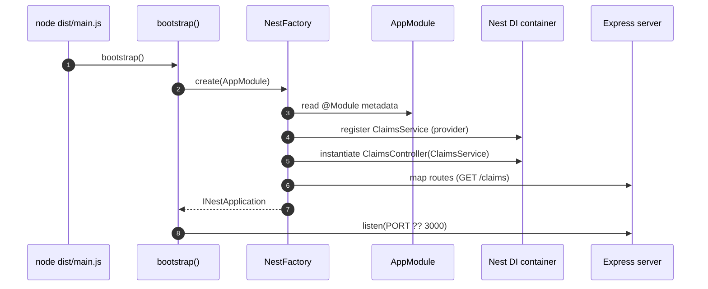

Note: `bootstrap()` is called without `.catch(...)`; a startup failure becomes an unhandled promise rejection.

### S2. `GET /claims` (as-is)

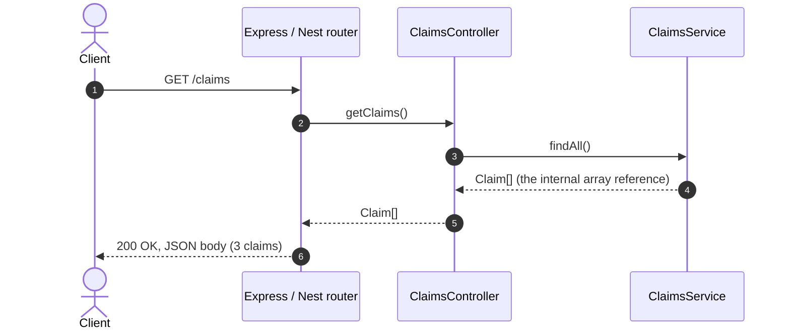

### S3. `GET /claims/:claimId`: the exercise (proposed behavior)

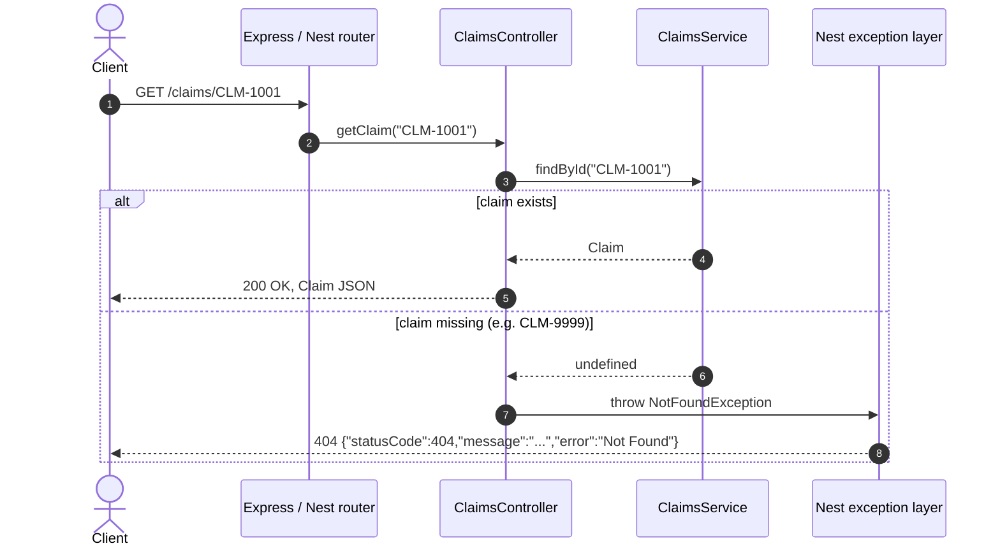

### S4. `GET /claims/:claimId` in the target platform (illustrative)

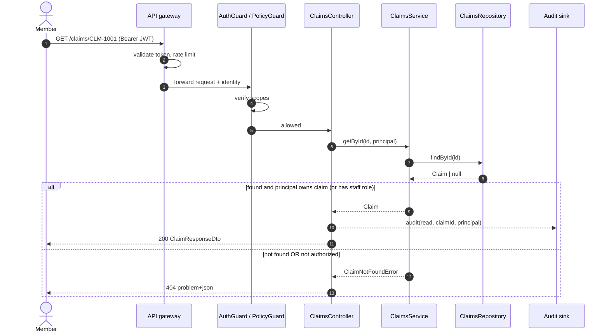

Returning `404` (not `403`) for claims the caller does not own avoids confirming that another member's claim exists.
